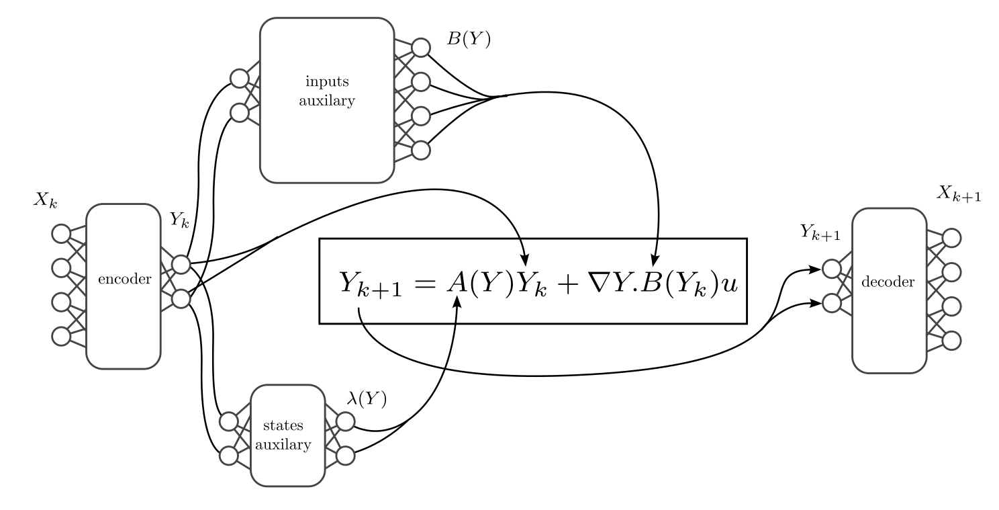
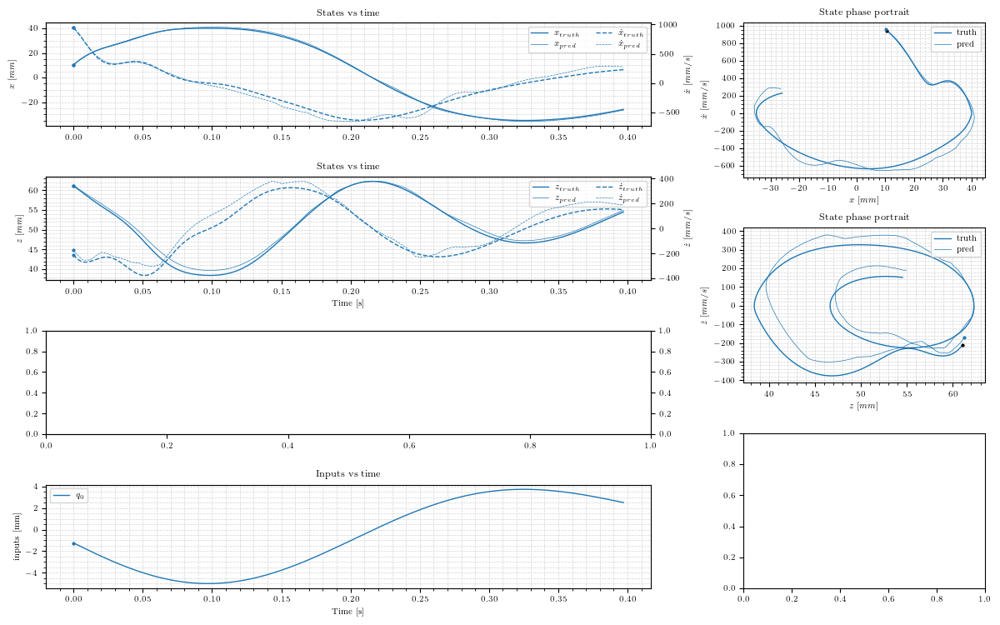
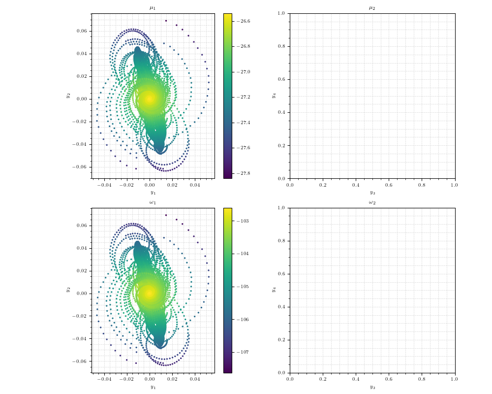
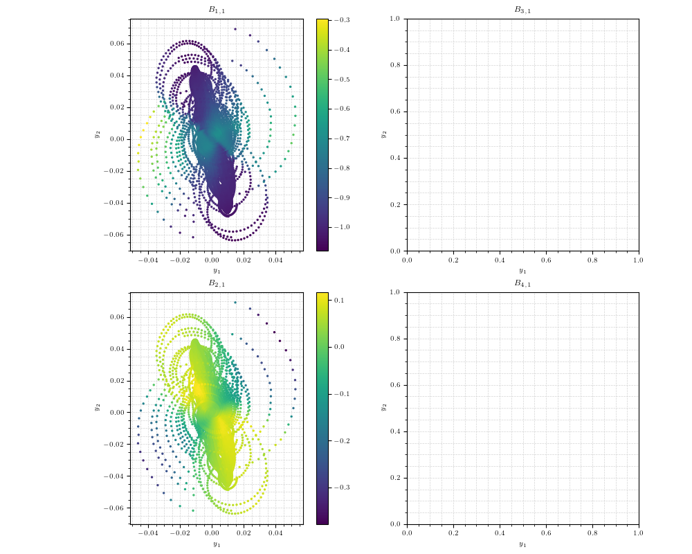
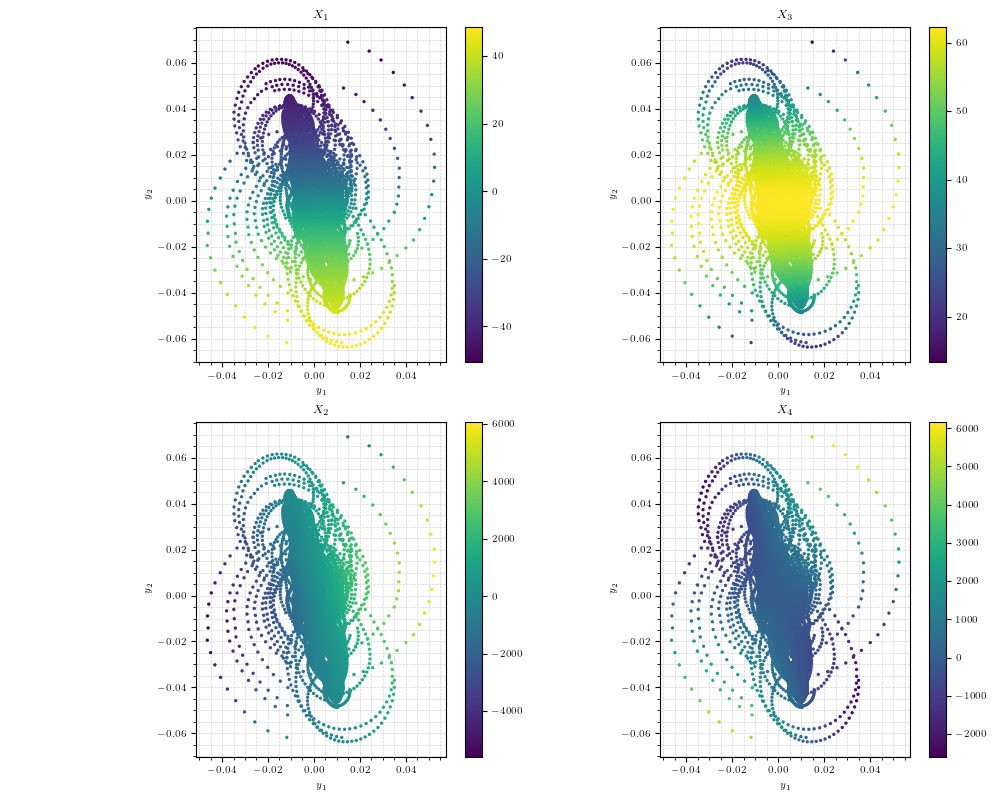

# Deep Koopman Cathter Model

## Introduction
A deeplearning based Koopman approach for modeling the nonlinear dynamics of tendon driven continuum robots.
This repository contains the codes for training the model networks usign Pytroch.

## Results

