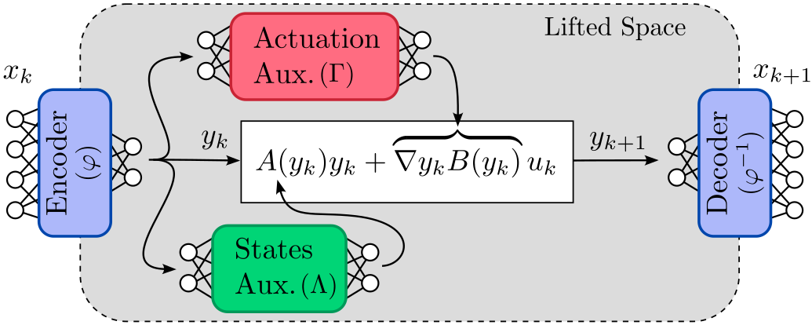
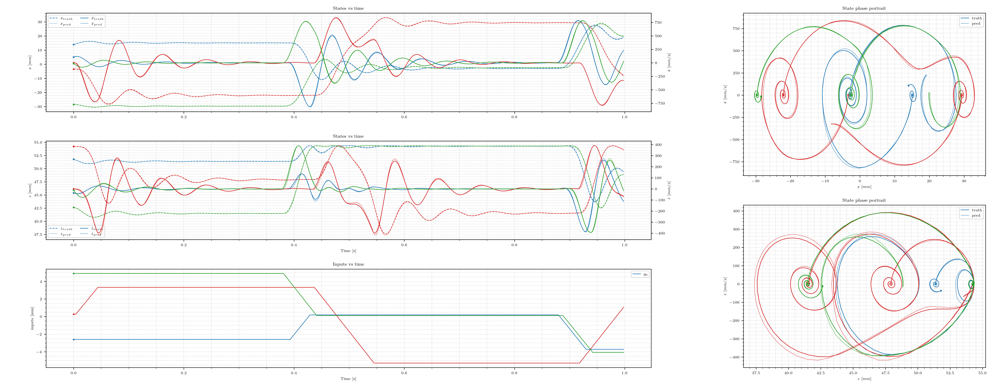
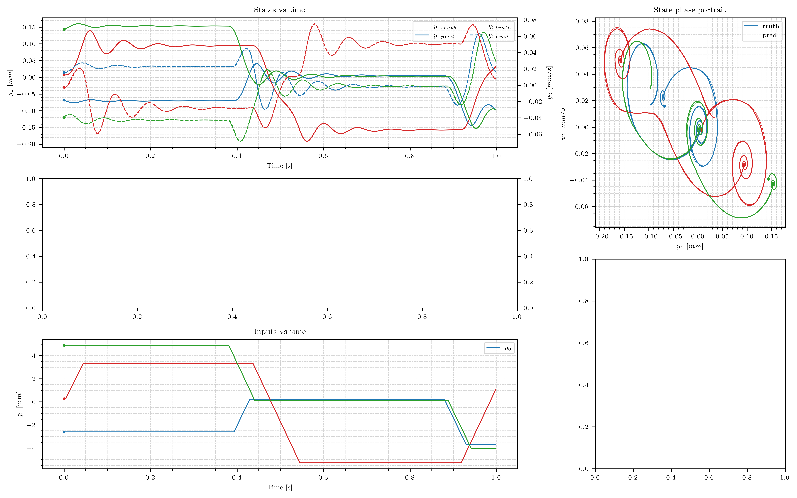
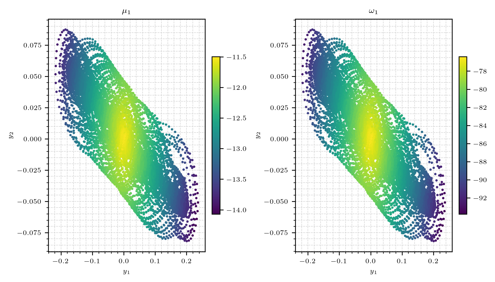
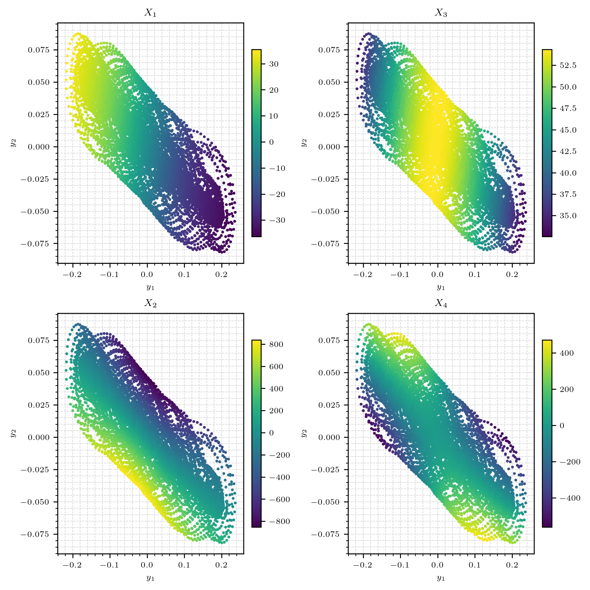

<div align="center">

# Deep Koopman Catheter Model

</div>

## Introduction
A deep learning based Koopman approach for modeling the nonlinear dynamics of tendon driven continuum robots.
This repository contains codes for training the model networks usign PyTroch.
This project aims to train a dynamical model of tendon-driven continuum robots using the deep Koopman approach. The code is organized into several modules to handle different aspects of the model, including data loading, model architecture, training, and prediction.



## Table of Contents

1. [Installation](#installation)
2. [Configuration](#configuration)
3. [Training the Model](#training-the-model)
4. [Making Predictions](#making-predictions)
5. [Project Structure](#project-structure)
6. [References](#references)


## Installation

To set up the environment and install the required dependencies, follow these steps:

1. Create and activate a virtual environment:
    ```bash
    python3 -m venv venv
    source venv/bin/activate
    ```

2. Install the required packages:
    ```bash
    pip install -r ./docs/requirements.txt
    ```

## Configuration

Configuration parameters are stored in `./model_fitting/config.py`. This file includes details such as model parameters, dataset options, training options, and more.


## Training the Model

To train the model, run `./model_fitting/train.py`. This script handles loading the dataset, initializing the model, and training it using the configurations specified in `config.py`.

```bash
python ./model_fitting/train.py
```

### Key tasks in `train.py`:
- **Data Loading**: Loads and preprocesses the dataset.
- **Model Creation**: Initializes the model architecture.
- **Training**: Trains the model using specified loss functions, optimizers, and schedulers.

## Making Predictions

After training the model, you can make predictions using `./model_fitting/predict.py`. Set the parameters in the preamble and run it. This script loads the trained model and performs predictions on new data.

```bash
python ./model_fitting/predict.py
```

### Key tasks in `predict.py`:
- **Model Loading**: Loads the trained model and its parameters.
- **Prediction**: Uses the model to make predictions on new input data.

## Project Structure

- `config.py`: Contains configuration parameters for the model, training, and dataset.
- `train.py`: Script to train the model.
- `predict.py`: Script to make predictions using the trained model.
- `trainer.py`: Contains the `Trainer` class which handles the training loop and model saving.
- `models.py`: Defines the model architectures used in the project.
- `utils.py`: Utility functions for data processing and normalization.
- `loss_functions.py`: Custom loss functions used for training the model.
- `predictor.py`: Defines the `Predictor` class for making predictions using the trained model.


## Results

Robot state prediction:


Lifted state prediction:


Eigen values:


Decoder map:



## References
- N. Feizi, F. C. Pedrosa, J. Jayender and R. V. Patel, "Deep Koopman Approach for Nonlinear Dynamics and Control of Tendon-Driven Continuum Robots," *IEEE Robotics and Automation Letters*, vol. 10, no. 3, pp. 2926-2933, 2025, [doi: 10.1109/LRA.2025.3533967](https://doi.org/10.1109/LRA.2025.3533967).

